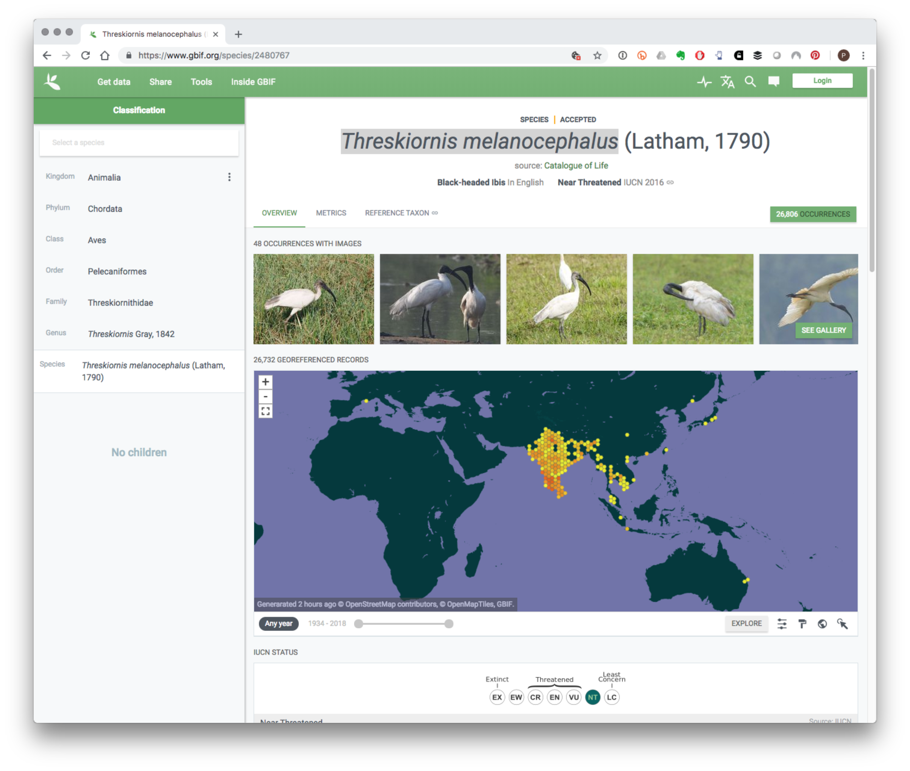

```{r setup, include=FALSE}
knitr::opts_chunk$set(echo = TRUE)
```

This article documents the process for creating an interactive taxonomic dashboard and options for linking a taxonomic dashboard with other data components. 

The process basically consists of taking a dataset of taxonomic information about a country and linking it dynamically with other information such as publications, patent data, DNA sequences, images or web searches.

A dashboard can use three sources of data

a) Data from a backend database
b) Make a call and ingest data from an API (responsiveness issue)
c) A simple web link that opens the results in a pane in the same page. Or a new tab (target="_blank"). Link break issue

A dashboard offers a summary of data that a user can interact with to answer questions. This is normally facilitated using a set of filters of various kinds. For example, filtering the data by kingdom to show only plants. 

In order to address specific issues a set of dashboards will normally be needed presenting specific views of the data for exploration. For ABS Monitoring under the Nagoya Protocol this will normally involve

a) Taxonomy dashboard

Use case: An applicant wants to collect particular species in a region in India. The desk officer wants to rapidly know:

a) where this species is known to be located in India, 
b) whether it has been the subject of earlier research
c) What the conservation status of the species is
d) Whether the research is proposed to take place in a protected area or not
e) Whether the species is linked with traditional knowledge
f) Whether there is existing commercial research and development revealed in patent data (as an indicator of potential or actual commercial interest)
g) Whether thete is genetic sequence data for the species or a DNA bar code

### A Taxonomic Dash

An example of a taxonomy dashboard is presented below using 6 million species occurrence records from India. The example is built in Tableau because it is easy to use to create mock ups. However, dashboards can be built with a range of other tools such as Javascript ...notably see D3, Flexdashboards in R and others. 

The dashboard can be visited [here](https://public.tableau.com/profile/poldham#!/vizhome/india_gbif/TaxonomyDashboard?publish=yes)

Note that the embedded dashboard below will display in a slightly crunched form inside a web page

In this view the focus is on presenting a summary of the data on a species and providing hyperlinks from the species names and the dots (showing the coordinates for the known occurrence of the species)

<iframe align = "center" width = "1200" height = "1000" src="https://public.tableau.com/profile/poldham#!/vizhome/india_gbif/TaxonomyDashboard?publish=yes"/>

The existing links are to 

a) scientific literature (crossref and core.ac.uk)
b) patent literature (using the Lens database)
c) Google Search for the species including traditional knowledge
d) Google Search including the word India
e) A lookup on GenBank for DNA sequence records (just for the species)

This approach focuses on triggering external links. An alternative approach is to embed a blank web page and trigger the response into that web page. An example of this is this page from the same Tableau workbook under Embedded Web Page.

Note that in Tableau this does not work particularly well in the public online version. It does work in the workbook in the desktop version of Tableau. In some cases nothing is displayed. 

To see results experiments with

- Lookup in Patent Title Abstract or Claims 
- Lookup in Patent
- Lookup Genbank

This gives an idea of the possiblity of triggering lookups from a species list (or a person list) to assist a desk officer with assessing applications.

### Map Layer Options

It would in future be desirable to add a map layer showing protected areas (national parks) to this kind of visualisation


## Conservation Status

The IUCN Red List provides information on the conservation status of species. However, it is not so easy to construct hyperlinks to the Red List and this would need to be done by passing the species to the Red List API service to retrieve the Red List Identifiers

### A note on the taxonomic data

The raw data for these views comes from GBIF for India with 6 million occurrence (observation) records [insert DOI]. 

The main information from this table that will typically be of interest (for finding out about the species) is

- kingdom
- phylum
- class
- order
- family
- genus
- species
- scientific name
- decimal latitude
- decimal longitude

Additional information of interest is 

- Locality
- Issues (which refer to issues with the observation data itself and mainly of interest for data preparation)

Important Keyas are

- gbifid (which relates in this data to the occurrence record)
- taxonkey
- specieskey

The specieskey (which is often but not always the same as the taxonkey) is used in the GBIF API and database for lookup. In the raw data (not shown here) the first row in the gbif data is for Threskiornis melanocephalus or the Black headed Ibis. We can select the records on the species key, 

```{r cache=TRUE, eval=FALSE}
india_raw %>% 
  filter(specieskey == "2480767")
```

That would give us 25,114 observations of this species in India. 

If we wanted to link out to the GBIF database or retrieve more data using the GBIF API then we would use the specieskey.

On the public website that would be here: [https://www.gbif.org/species/2480767](https://www.gbif.org/species/2480767)

Note that the species key is simply added to the end of the URL and leads to this page. 

```{r echo=FALSE, eval = FALSE}

```


When working with GBIF data (as discussed in detail [here](https://poldham.github.io/abs/gbif.html)) note that many of the observation records will be for birds. Bird data will often flood the dataset. 

Other searches of taxonomic data sources can be added such as 

The encyclopedia of life

http://eol.org/search/q=Threskiornis%20melanocephalus

The Biodiversity Heritage Library (for older digitised texts)

http://www.biodiversitylibrary.org/name/Threskiornis_melanocephalus

Note that creating these links requires attention to the specific URL structures for the external sources. 

### Summarising the Data

For summaries of the data as above note that a combination will be needed of count and count distinct. Thus count would be used to count up the occurrences associated with a species. Count distinct would be used to count up the number of species in a kingdom for this data. It is important to check the counts to avoid unexpected results.

## Combining Dashboards

When datasets are available from the scientific literature or the patent literature it is possible to construct dashboards that combine the different data sources, Thus, in reviewing an application for an ABS permit or in reviewing the outputs of research we might want to look 


